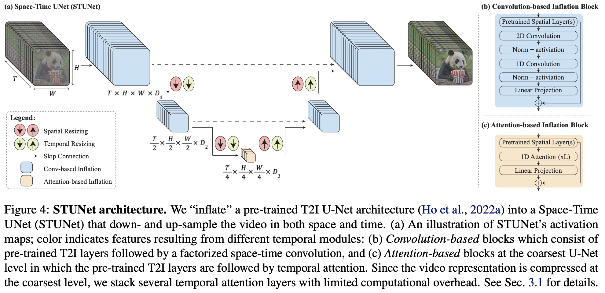

</img>

## Lumiere - Pytorch (wip)

Implementation of <a href="https://lumiere-video.github.io/">Lumiere</a>, SOTA text-to-video generation from Google Deepmind, in Pytorch

<a href="https://www.youtube.com/watch?v=Pl8BET_K1mc">Yannic's paper review</a>

Since this paper is mostly just a few key ideas on top of text-to-image model, will take it a step further and extend the new <a href="https://github.com/lucidrains/denoising-diffusion-pytorch/blob/main/denoising_diffusion_pytorch/karras_unet.py">Karras U-net</a> to video within this repository.

## Appreciation

- <a href="https://a16z.com/supporting-the-open-source-ai-community/">A16Z Open Source AI Grant Program</a> and <a href="https://huggingface.co/">🤗 Huggingface</a> for the generous sponsorships, as well as my other sponsors, for affording me the independence to open source current artificial intelligence research

## Install

```bash
$ pip install lumiere-pytorch
```

## Usage

```python
import torch
from lumiere_pytorch import Lumiere

from denoising_diffusion_pytorch import KarrasUnet

karras_unet = KarrasUnet(
    image_size = 256,
    dim = 8,
    channels = 3,
    dim_max = 768
)

lumiere = Lumiere(
    karras_unet,
    image_size = 256,
    unet_time_kwarg = 'time',
    conv_module_names = [
        'downs.1',
        'ups.1'
    ],
    attn_module_names = [
        'mids.0'
    ],
)

noised_video = torch.randn(2, 3, 8, 256, 256)
time = torch.ones(2,)

denoised_video = lumiere(noised_video, time = time)

assert noised_video.shape == denoised_video.shape
```

## Todo

- [x] add all temporal layers
    - [x] researcher must pass in all layers for
        - [x] conv inflation modules (stages)
        - [x] attn inflation modules (middle)
        - [x] temporal downsample
        - [x] temporal upsamples
    - [x] validate time dimension is 2 ** downsample layers
    - [x] validate number of downsamples == upsamples
    - [x] at init, do a dry run with a mock tensor and assert output is the same

- [x] expose only temporal parameters for learning, freeze everything else

- [ ] figure out the best way to deal with the time conditioning after temporal downsampling - instead of pytree transform at the beginning, probably will need to hook into all the modules and inspect the batch sizes

- [ ] handle middle modules that may have output shape as `(batch, seq, dim)`
- [ ] following the conclusions of Tero Karras, improvise a variant of the 4 modules with magnitude preservation

## Citations

```bibtex
@inproceedings{BarTal2024LumiereAS,
    title   = {Lumiere: A Space-Time Diffusion Model for Video Generation},
    author  = {Omer Bar-Tal and Hila Chefer and Omer Tov and Charles Herrmann and Roni Paiss and Shiran Zada and Ariel Ephrat and Junhwa Hur and Yuanzhen Li and Tomer Michaeli and Oliver Wang and Deqing Sun and Tali Dekel and Inbar Mosseri},
    year    = {2024},
    url     = {https://api.semanticscholar.org/CorpusID:267095113}
}
```

```bibtex
@article{Karras2023AnalyzingAI,
    title   = {Analyzing and Improving the Training Dynamics of Diffusion Models},
    author  = {Tero Karras and Miika Aittala and Jaakko Lehtinen and Janne Hellsten and Timo Aila and Samuli Laine},
    journal = {ArXiv},
    year    = {2023},
    volume  = {abs/2312.02696},
    url     = {https://api.semanticscholar.org/CorpusID:265659032}
}
```

